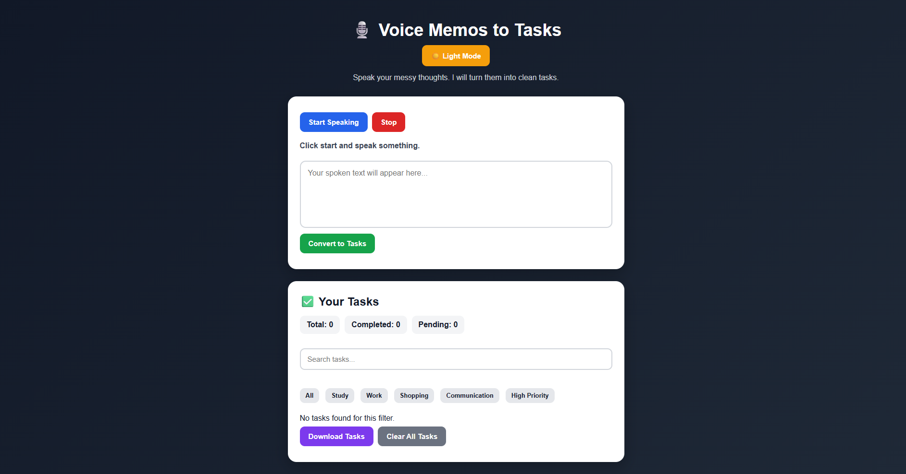

# Voice Memos to Tasks

> A web‑based productivity app that turns spoken or typed notes into organized tasks.

---

## 🚀 Features

- Convert voice memos into clean task lists  
- Convert typed notes into tasks  
- Detect dates, times, and priorities (e.g., *urgent*, *normal*) from task text  
- Auto‑categorize tasks  
- Search tasks by keyword  
- Filter by category or high priority  
- Mark tasks as completed or pending  
- Edit and delete tasks  
- View statistics (total, completed, pending)  
- Download tasks as a text file  
- Dark & light mode support  
- Persist tasks locally in the browser (no server required)

---

## 📦 Tech Stack


---

## 📥 Installation

```bash
# 1. Clone the repository
git clone https://github.com/saksham944-tech/voice-memos-to-tasks.git

# 2. Open the project folder
cd voice-memos-to-tasks

# 3. Open index.html in your browser
```

---

## 🛠️ Usage

1. Open the website in a browser.  
2. Click **Start Speaking** and allow microphone permission.  
3. Speak your tasks naturally or type them in the text box.  
4. Click **Convert to Tasks**.  
5. Use filters, search, edit, mark as done, delete, and download options to manage your tasks.

---

## 📁 Project Structure

```
voice-memos-to-tasks/
│
├── index.html
├── style.css
├── script.js
├── home.png
└── README.md
```

---

## 📸 Screenshot



---

## 🌐 Links

- [Live Demo](https://saksham944-tech.github.io/voice-memos-to-tasks/)  
- [Repository](https://github.com/saksham944-tech/voice-memos-to-tasks)  
- [GitHub Profile](https://github.com/saksham944-tech)

---

## 🔮 Future Scope

- AI‑based task extraction for better natural‑language understanding  
- User login and cloud storage  
- Reminder notifications  
- Google Calendar integration  
- Mobile app version  
- Multi‑language support  
- Task due‑date sorting  
- Recurring tasks feature  

---

## 👤 Author

**Saksham Gupta**  
[GitHub](https://github.com/saksham944-tech)

---